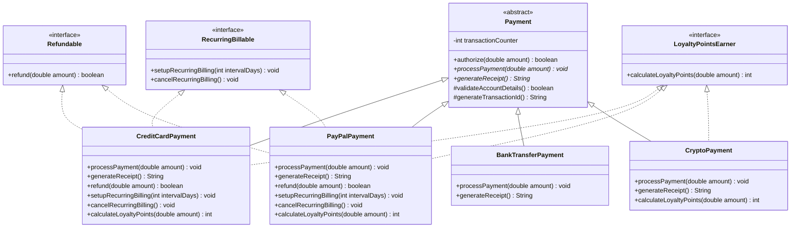

## Problem 1: Animal

## Sample Output:
--- Dog ---
Buddy is eating
Buddy says Woof!
Buddy is sleeping
Buddy is swimming

--- Cat ---
Whiskers is eating
Whiskers says Meow!
Whiskers is sleeping

--- Bird ---
Tweety is eating
Tweety says Tweet!
Tweety is sleeping
Tweety is flying

---

## Problem: Design a Simple Animal Shelter System

You're building a small program to manage animals in an animal shelter. You need to model **Dog**, **Cat**, and **Bird**.

### Requirements

1. **Every animal** must be able to:
   - `eat()` — print a message like `"Buddy is eating"`
   - `makeSound()` — each animal makes a different sound (bark, meow, chirp), so there's no single shared way to do this

2. **Every animal shares identical logic** for:
   - `sleep()` — always prints `"[name] is sleeping"` (exactly the same for every animal — no need to write this more than once)
   - Every animal also has a `name` field, set once when the animal is created

3. **Some animals can fly** (Bird can, Dog and Cat cannot). Flying isn't related to being an animal — it's a separate ability.

4. **Some animals can swim** (Dog can swim, Bird and Cat cannot — let's assume cats don't swim in this shelter's world).

---

### Your Tasks

**Part A — Decide the design**
For this system, decide:
- Should `Animal` be an **abstract class** or an **interface**? Why?
- Should `Swimmer` and `Flyer` be **abstract classes** or **interfaces**? Why?

**Part B — Write the code**
Implement in Java:
- `Animal` (abstract class) with:
  - a `name` field
  - a constructor that sets `name`
  - concrete method `sleep()`
  - abstract method `makeSound()`
- `Swimmer` interface with method `swim()`
- `Flyer` interface with method `fly()`
- Classes `Dog`, `Cat`, `Bird` that extend `Animal` and implement the correct interfaces

**Part C — Answer in 1–2 sentences**
1. Why can't `Dog extends Animal, Swimmer` work in Java (i.e. why can a class only `extends` one class)?
2. Why does `sleep()` belong in `Animal` instead of being copy-pasted into `Dog`, `Cat`, and `Bird` separately?
3. Why is `makeSound()` marked abstract instead of given a shared implementation like `sleep()`?

---

### Starter hint (to guide beginners)

```java
abstract class Animal {
    String name;

    Animal(String name) {
        this.name = name;
    }

    void sleep() {
        System.out.println(name + " is sleeping");
    }

    abstract void makeSound(); // no shared behavior possible — every animal differs
}

interface Swimmer {
    void swim();
}

interface Flyer {
    void fly();
}

class Dog extends Animal implements Swimmer {
    Dog(String name) {
        super(name);
    }

    void makeSound() {
        System.out.println(name + " says Woof!");
    }

    public void swim() {
        System.out.println(name + " is swimming");
    }
}
```

Students then complete `Cat` (no extra interface) and `Bird` (implements `Flyer`), plus a `Main` class that creates one of each and calls all their methods.

---

### Simple decision table to give students

| Question to ask | If yes → use |
|---|---|
| Do all these classes share the exact same working code? | Abstract class |
| Is this describing what the object fundamentally **is**? | Abstract class |
| Is this an optional **ability**, not every subtype has it? | Interface |
| Does a class need this ability **plus** another unrelated ability? | Interface (since a class can implement many interfaces but extend only one class) |

---

### Why this version works well for beginners
- Only 3 concrete classes, 1 abstract class, 2 tiny interfaces — small enough to hold in your head.
- Every requirement maps directly and obviously to a rule (shared code → abstract class, optional ability → interface), so the reasoning is easy to spot without prior design experience.
- The starter code removes syntax friction, so the assessment focuses on **the decision**, not Java mechanics.

- 
## Problem 2: Design a Payment Processing System

Your company is building a payment processing system for an e-commerce platform. You need to model the following requirements:

1. **All payment methods** (Credit Card, PayPal, Bank Transfer, Cryptocurrency) must be able to:
   - `authorize(double amount)` — validate the payment can proceed
   - `processPayment(double amount)` — execute the transaction
   - `generateReceipt()` — return a formatted receipt string

2. **Some payment methods share common behavior**:
   - Credit Card and Bank Transfer both need to **validate a routing/account number format** before processing, and this validation logic is *identical* for both (a shared `validateAccountDetails()` method with real, non-abstract implementation).
   - All payment methods need a **transaction ID generator** — this logic is also identical across all types (e.g., using a shared counter + timestamp), and should not be reimplemented in every class.

3. **Some payment methods can ALSO be refunded**, but not all. Cryptocurrency payments, for instance, **cannot** be refunded once processed (irreversible by design), while Credit Card and PayPal **can** be refunded.

4. **Some payment methods can ALSO support recurring/subscription billing** (e.g., Credit Card, PayPal), while others (Bank Transfer, Cryptocurrency) cannot.

5. A `LoyaltyPointsEarner` capability should be **mixable** into any payment method that qualifies for loyalty points — but a class might already extend something else, so this must not block that.

---

### Your Tasks

**Part A — Design**
Design the class/interface hierarchy for this system. For each type you introduce, state explicitly:
- Whether it is an **abstract class** or an **interface**
- **Why** you chose one over the other for that specific case (reference the requirement that drove the decision)

**Part B — Implementation**
Implement the hierarchy in Java, including:
- At least one abstract class with **both abstract and concrete (shared) methods**
- At least two interfaces representing **optional/mixable capabilities** (`Refundable`, `RecurringBillable`, `LoyaltyPointsEarner`)
- Four concrete classes: `CreditCardPayment`, `PayPalPayment`, `BankTransferPayment`, `CryptoPayment` — each implementing/extending the correct combination of types

**Part C — Justification Questions**
Answer briefly (2–3 sentences each):
1. Why can't `validateAccountDetails()` and the transaction ID generator live in an interface instead of an abstract class?
2. Why can't `Refundable` and `RecurringBillable` be implemented as abstract classes instead of interfaces?
3. Suppose a new requirement arrives: "All payment methods must log every transaction to an external audit system with identical logging logic." Would you add this to the abstract class or a new interface? Justify your answer.
4. If `CryptoPayment` needed to both extend the abstract payment class **and** gain the ability to be `LoyaltyPointsEarner`, why does this design still work in Java, whereas it would fail if `LoyaltyPointsEarner` were also an abstract class?

---

### What this problem is testing

| Concept | Where it's tested |
|---|---|
| Abstract class = shared *state* + shared *implementation* + "is-a" relationship | Common `validateAccountDetails()`, transaction ID generator |
| Interface = capability/contract, no shared state, supports multiple inheritance | `Refundable`, `RecurringBillable`, `LoyaltyPointsEarner` mixed independently |
| Single inheritance limitation of abstract classes | Part C, Q4 |
| When *not* to force everything into one abstract class | Recognizing Crypto shouldn't implement `Refundable` |
| Real-world modularity/extensibility reasoning | Q3 — new cross-cutting requirement |

---

### Sample Rubric (for grading)

- **Correct identification of abstract class use** (shared implementation + partial abstraction) — 25%
- **Correct identification of interface use** (optional, mixable, no shared implementation needed) — 25%
- **Correct compiling implementation** with proper method combinations per class — 30%
- **Justification quality** — reasoning grounded in *design principles* (not just "interfaces don't have constructors") — 20%

---


